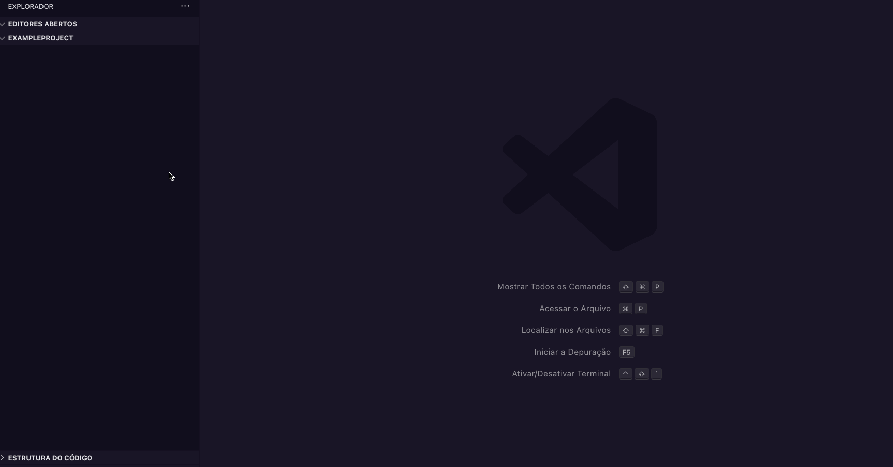
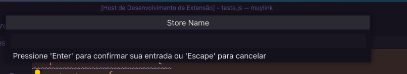
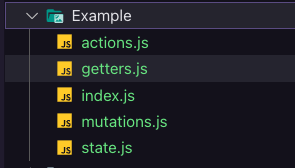

# Vuex Store Generator

## Description

Is a tool to generate modular store files, where we can keep our Vuex store always with the same pattern.

## Usage

## Screenshots
  

- Action Menu
  

- Input Box

- Generated Store

## Installation

- [Vuex Store Generator Marketplace](https://marketplace.visualstudio.com/items?itemName=ygorazambuja.vuex-store-generator)

- or search Vuex Store Generator on VSCode extensions sidebar. 

## Tech Stack

**Server:** Typescript 

## Roadmap

- Add right click to modulate the chosen store.

## Authors

- [Github](https://www.github.com/ygorazambuja)
- [LinkedIn](https://www.linkedin.com/in/ygorazambuja)

## Licence
[MIT](LICENSE)
